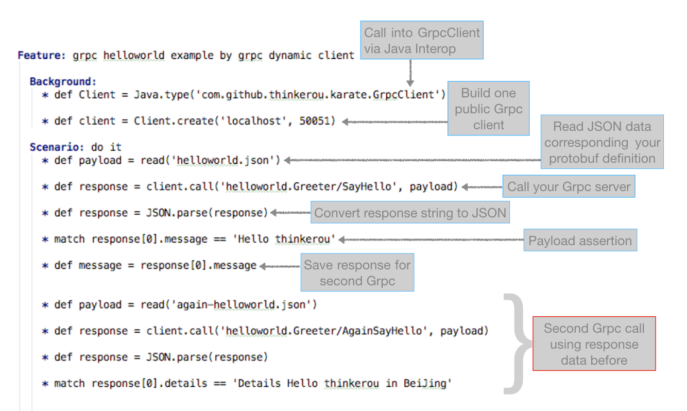
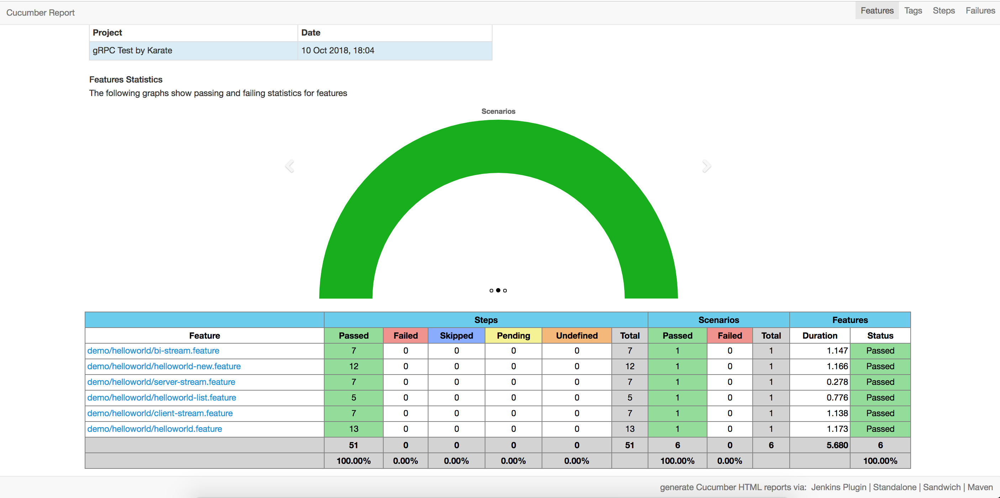

# karate-grpc

[](https://travis-ci.org/thinkerou/karate-grpc)

simple gRPC testing with [karate](https://github.com/intuit/karate) and a dynamic client using [polyglot](https://github.com/grpc-ecosystem/polyglot).

karate-grpc makes it easy to:
* build complex protobuf request payloads via json
* traverse data within the responses 
* chain data from responses into the next request.

## Hello World

[](assets/karate-grpc-hello-world.png)

## Testing hello world
Requires maven to be installed
```
$ # compile and test the whole project
$ mvn clean install

$ # test demo
$ cd karate-grpc-demo
$ mvn test
$ # or run single test
$ mvn test -Dtest=HelloWorldNewRunner
```

When running tests, the hello world grpc server is started/stopped automatically in `AbstractTestBase.java`.

Karate also generates beautiful test reports:

[](assets/karate-grpc-hello-world-report.png)

## Real World Examples

A set of real-life examples which includes `single rpc`, `client stream rpc`, `server stream rpc` and `bidi stream rpc` can be found here: [karate-grpc-demo](karate-grpc-demo)

## Getting Started

karate-grpc requires Java 8 and then Maven to be installed, these also are required by [karate](https://github.com/intuit/karate) and [polyglot](https://github.com/grpc-ecosystem/polyglot).

> karate-grpc only support Maven currently.

### Maven

You need to add the following `<dependencies>`:

```maven
<dependency>
    <groupId>com.github.thinkerou</groupId>
    <artifactId>karate-grpc-core</artifactId>
    <version>1.0.6</version>
</dependency>
```

### Gradle

> TODO: need to test!!!

Alternatively for Gradle you need to add the following entry:

```gradle
testImplementation 'com.github.thinkerou:karate-grpc-core:1.0.6'
```

And simulates `karate-grpc-helper` and `karate-grpc-demo` build your redis helper project and test project.

## What to need for testing grpc server

Testing one grpc server, we have the follow info:

- grpc server `ip` and `port`.

- (optional) protobuf file corresponding grpc server, but usually it's protobuf `jar package` not one single file or more files.

So, we could test it based on the two point.

**⚠️ Using karate-grpc we can perfect to solve it!**

## What to need in pom file

For testing your grpc server, as above, need protobuf jar dependency and protobuf build plugins - [`protobuf-maven-plugin`](https://www.xolstice.org/protobuf-maven-plugin/).

**MUST** appoint `descriptorSetFileName` and `protoSourceRoot` params:

```
<descriptorSetFileName>karate-grpc.protobin</descriptorSetFileName>
<protoSourceRoot>${project.build.directory}/dependency/demo</protoSourceRoot>
```

Especially, `descriptorSetFileName` **MUST** equal `karate-grpc.protobin`, please see [here](karate-grpc-core/src/main/java/com/github/thinkerou/karate/constants/DescriptorFile.java) about more details.

And other pom settings are the same as `karate`.

## How to write karate feature

We need to use [Java interop](https://github.com/intuit/karate#java-interop) of Karate in order to call us define grpc client.

And use `JSON.parse` javascript function parse the response of grpc server return value.

So, use `karate-grpc` need the following steps:

1. Calls into karate-grpc GrpcClient via Java Interop.

```
* def GrpcClient = Java.type('com.github.thinkerou.karate.GrpcClient')
```

2. Builds one public Grpc client using your grpc ip and port.

```
* def client = new GrpcClient('localhost', 50051)
```

If you want to list protobuf by service name or/and message name, you should use:

```
* def client = new GrpcClient()
```

Because you don't need grpc server ip/port when listing protobuf.

3. Reads JSON data corresponding your protobuf definition.

4. Calls your Grpc server using `call` of karate-grpc.

```
* def response = client.call('helloworld.Greeter/SayHello', payload)
```

`call` have two params: protobuf full name(`format:<package-name>.<service-name>/<rpc-name>`) and JSON data.

If you input protobuf full name error, `call` will fail and output protobuf message by `list`, like this:

When input `helloworld.Greeter/SayHello1`, it will fail and print log:

```
Oct 11, 2018 6:53:24 PM com.github.thinkerou.karate.service.GrpcCall invoke
警告: Call grpc failed, maybe you should see the follow grpc information.
Oct 11, 2018 6:53:24 PM com.github.thinkerou.karate.service.GrpcCall invoke
信息: [
  {
    "helloworld.Greeter/SayHelloBiStreaming":"",
    "helloworld.Greeter/RecordRoute":"",
    "helloworld.Greeter/RouteChat":"",
    "helloworld.Greeter/SayHelloServerStreaming":"",
    "helloworld.Greeter/ListFeatures":"",
    "helloworld.Greeter/SayHello":"",
    "helloworld.Greeter/AgainSayHello":"",
    "helloworld.Greeter/SayHelloClientStreaming":"",
    "helloworld.Greeter/GetFeature":""
  }
]

```

5. Converts response string to JSON.

```
* def response = JSON.parse(response)
```

Because `call` of karate-grpc returns JSON string, we need to convert it and then can use `match` assertion.

6. Asserts payload.

7. (Optional) Saves response for second Grpc.

If have second Grpc use the response of first Grpc, we should save it, like:

```
* def message = response[0].message
```

And use it on JSON file:

```
[
  {
    "message": "#(message)",
    "address": "BeiJing"
  }
]
```

8. (Optional) Second Grpc call using response data before.

One whole example likes [this](karate-grpc-demo/src/test/java/demo/helloworld/helloworld-new.feature):

```
Feature: grpc helloworld example by grpc dynamic client

  Background:
    * def client = Java.type('demo.DemoGrpcClientSingleton').INSTANCE.getGrpcClient();

  Scenario: do it
    * string payload = read('helloworld.json')
    * def response = client.call('helloworld.Greeter/SayHello', payload)
    * def response = JSON.parse(response)
    * print response
    * match response[0].message == 'Hello thinkerou'
    * def message = response[0].message

    * string payload = read('again-helloworld.json')
    * def response = client.call('helloworld.Greeter/AgainSayHello', payload)
    * def response = JSON.parse(response)
    * match response[0].details == 'Details Hello thinkerou in BeiJing'
```

### How to write JSON file

Because `karate-grpc` supports stream grpc, we use `list` JSON.

Input JSON file like:

```
[
  {
    "name": "thinkerou"
  },
  {
    "name": "thinkerou2"
  }
]
```

Output JSON string also like:

```
[
  {
    "message": "Hello thinkerou"
  },
  {
    "message": "Hello thinkerou2"
  }
]
```

**That's all!!!**

## Redis

### Why use Redis?

Using redis is optional, but caching descriptor sets may save compile time, especially when your project has many protobuf jar package dependencies.

### Mock Redis
You can even use jedis-mock so you don't even need to install Redis.
see [MockRedisSingleton.java](karate-grpc-core/com/github/thinkerou/karate/utils/MockRedisSingleton.java): 

### Redis performance
<i>Note: while the redis test implementation is thread-safe, Redis uses single-threaded execution so test performance may be degraded for high concurrency.</i>  

To use redis, use class `com.github.thinkerou.karate.RedisGrpcClient` instead of `com.github.thinkerou.karate.GrpClient`

[example](karate-grpc-demo/src/test/java/demo/helloworld/helloworld-new.feature):

```
public enum DemoGrpcClientSingleton {
    INSTANCE;

    RedisGrpcClient redisGrpcClient;

    public GrpcClient getGrpcClient() {
        return redisGrpcClient;
    }

    DemoGrpcClientSingleton() {
        redisGrpcClient = new RedisGrpcClient("localhost", 50051, MockRedisSingleton.INSTANCE.getRedisHelper());
    }
}
```
**TODO:**

- Save `ProtoFullName|InputType|InputMessage|OutputType|OutputMessage|ProtoFileName|RPCAddress` not file content.
- Support java reflection mode.

## How to write grpc client

**Note:**

> - The part content is outdated draft which initially think about the topic which continues to have saved is for reference only.
> - Usually you no need to care it and skip it, because `karate-grpc-core` have completed the function.

You only need two steps:

- Read json file and parse protobuf object to the request of grpc server

- format the response of grpc server to json string and return it as grpc server

Like this:

```java
public class Client {

  // ...

  public static String greet(String input) {
    HelloRequest.Builder requestBuilder = HelloRequest.newBuilder();
    try {
      JsonFormat.parser().merge(input, requestBuilder);
    } catch (ProtocolBufferException e) {
      // ...
    }

    HelloReply response = null;
    try {
      response = blockingStub.sayHello(requestBuilder.build());
    } catch (StatusRuntimeException e) {
      // ...
    }

    String res = "";
    try {
      res = JsonFormat.printer().print(response);
    } catch (ProtocolBufferException e) {
      // ...
    }

    return res;
  }

  // ...
}

```


## Thanks 

Thanks [Peter Thomas](https://github.com/ptrthomas) for his work for [karate](https://github.com/intuit/karate) and his generous help, also thanks [Dino Wernli](https://github.com/dinowernli) for his contributions for [polyglot](https://github.com/grpc-ecosystem/polyglot). And the favicon of organization generate at [favicon.io](https://favicon.io/).

## Reference

Maybe you want to know more information about Karate or other, please read the follow contents:

- karate project home: [https://github.com/intuit/karate](https://github.com/intuit/karate)

- polyglot project home: [https://github.com/grpc-ecosystem/polyglot](https://github.com/grpc-ecosystem/polyglot)

- ProtoBuf(via JSON) project home: [https://github.com/protocolbuffers/protobuf/tree/master/java](https://github.com/protocolbuffers/protobuf/tree/master/java)

- grpc-java project home: [https://github.com/grpc/grpc-java](https://github.com/grpc/grpc-java)

## License

[karate-grpc](https://thinkerou.com/karate-grpc/) is licensed under MIT License.
